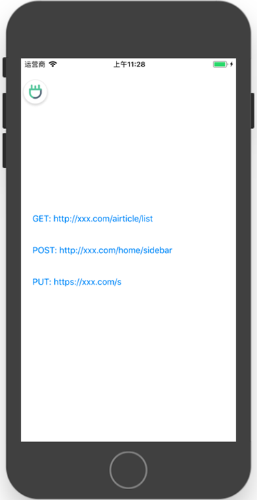
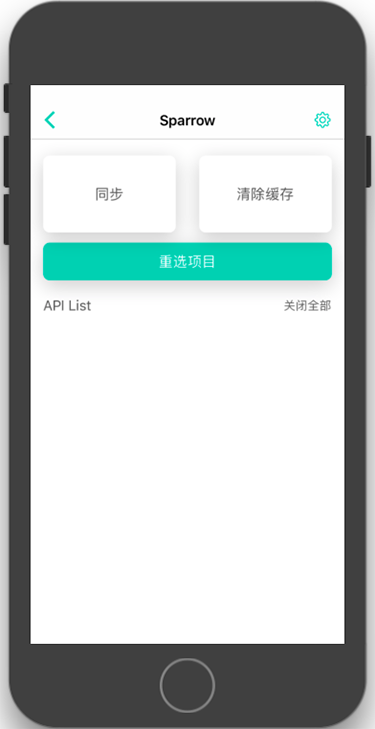
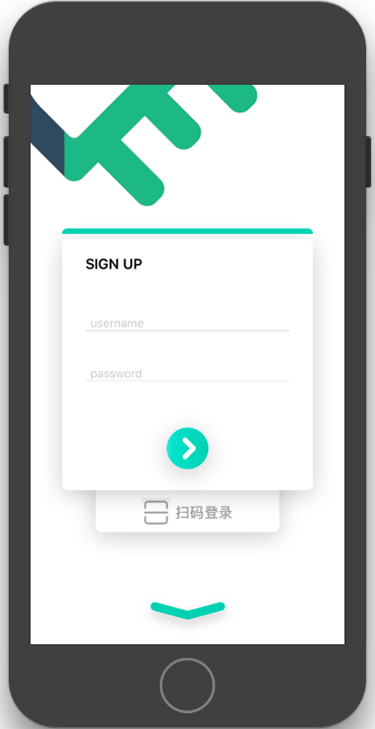
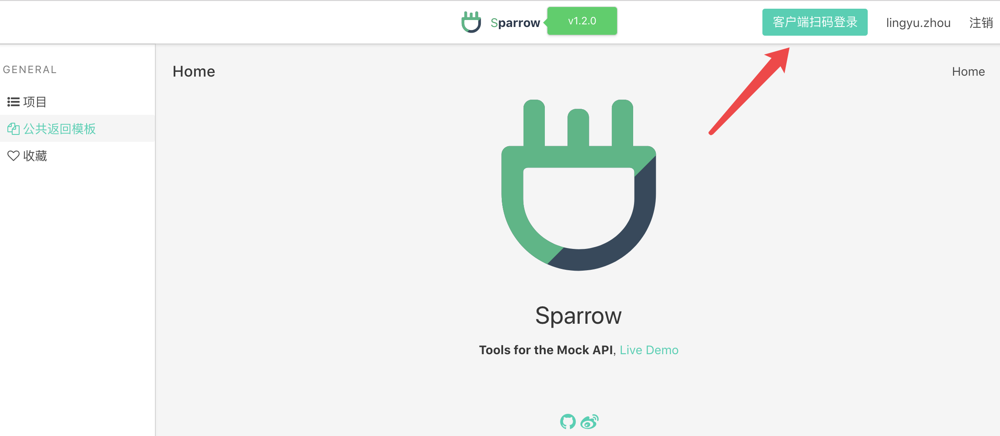
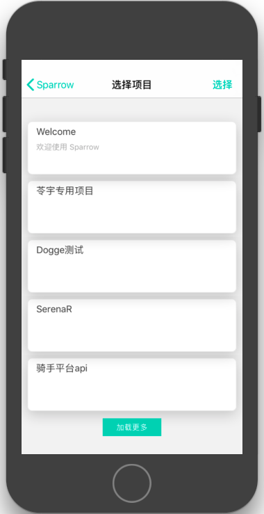
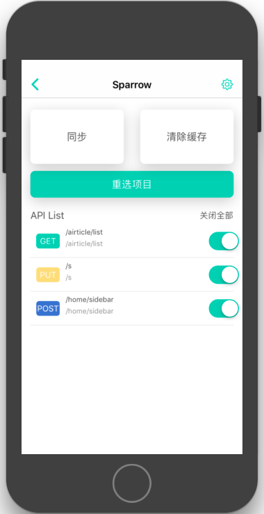
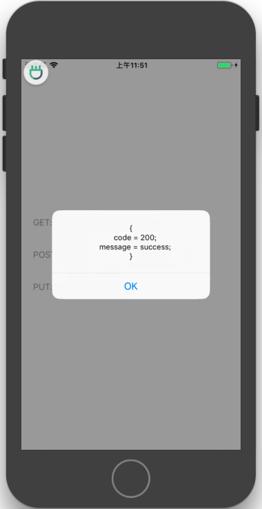
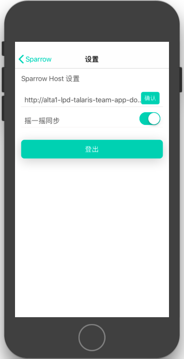

# SparrowSDK

SparrowSDK 是配合 [Sparrow](https://github.com/eleme/Sparrow) Server 使用的 iOS 端 SDK，集成后可以不需要修改业务代码，即可 Mock API。

## 集成

```ruby
pod 'SparrowSDK', :configurations => ['Debug']
```

## 集成

```ruby
pod 'SparrowSDK', :configurations => ['Debug']
```

在 `AppDelegate` 的  `didFinishLaunchingWithOptions` 中加上以下代码：

```objc
SPROptions *options = [SPROptions new];
options.hostURL = @"http://your.sparrow.host";
[SparrowSDK startWithOption:options];
```

Sparrow 使用了 `NSURLProtocol ` 监控网络，如果您还有其他的 `NSURLProtocol ` 网络监控，可以将 `[SPRURLProtocol class]` 添加进去。

## 简介

当部署好 Sparrow 服务器，并集成好 SDK 后，打开您的 app，会看到一个 Sparrow 的悬浮框。




点击左上角的悬浮窗，可以进入 Sparrow 的控制中心



点击『重选项目』。如果没有登录过，会弹出登录页面



输入在 Sparrow 系统上的账户名密码，或者使用『扫码登录』。

如果使用扫码登录，二维码在 Sparrow 系统登录后的导航栏处。



点击后就会弹出二维码，一分钟有效。使用 SparrowSDK 扫码可以免输入登录。

登录后，在『选择项目页』就会拉取到登录账户有权限访问的所有项目列表。



点击右上角『选择』 -> 选择您想同步的项目 -> 点击完成 -> 自动返回到控制中心，拉取到同步的 API 列表



现在我们拉取了『Welcome』项目里的所有 API，可以观察到和我们首页访问的三个示例 API path 部分项目。

点击返回，回到首页，这时，我们再点击三个按钮，就可以访问到在 Sparrow 系统里设置好的返回数据。




## Mock 工作方式

SparrowSDK 的使用没有侵入性。

大多数 Mock 系统需要更改移动端的网络请求代码，对开发过程造成了很多不必要的麻烦，甚至导致开发者会忘记改回代码，将访问 Mock 服务器的代码发布到线上。

SparrowSDK 的工作方式是：

1. 拦截所有的网络请求
2. 进行过滤，如果一个 NSURLRequest 的 `path` 部分和同步下来的 API `path` 部分相同，则进行转发，将请求转发哦到 Sparrow 服务器上
3. 接收到 Sparrow 服务器上对应的数据

通过转发的拦截转发，开发过程中不需要做任何网络请求的代码改动。**如果在 Sparrow 系统上做了 API 的更改、增加、删除，只需要在继承了 SparrowSDK 的 App 上摇一摇手机，即可同步**。

当然，你也可以在 Sparrow 的设置页面关闭『摇一摇』功能。



如果 Sparrow 的服务器位置更改了，或者自行搭建了 Sparrow 服务器，可以通过更改上图中的『Sparrow Host』来保证 SparrowSDK 的正常使用。

## 自定义

Sparrow 也提供了自定义的启动样式，您可以不使用悬浮框样式：

```objc
SPROptions *options = [SPROptions new];
options.hostURL = @"http://alta1-lpd-talaris-team-app-download-1.vm.elenet.me";
options.sytle = SPROptionsSytleCustom;
[SparrowSDK startWithOption:options];
```

如果您使用 `SPROptionsSytleCustom` 作为样式，SparrowSDK 在初始化后将不会出现悬浮框，您可以手动调用以下代码打开 SparrowSDK 的控制中心：

```objc
[SparrowSDK showControlPage];
```

或使用以下代码关闭 SparrowSDK 的控制中心：

```objc
[SparrowSDK dismissControlPage];
```

## Other

如果在使用过程中有任何问题，欢迎联系我（coderfish@163.com | 周凌宇）😘

Anyway，希望用的开心~